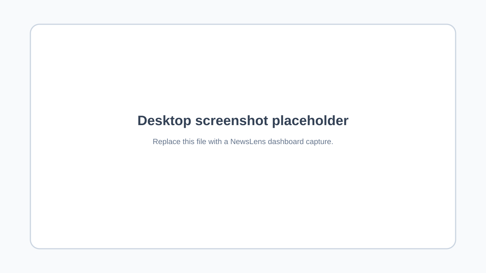
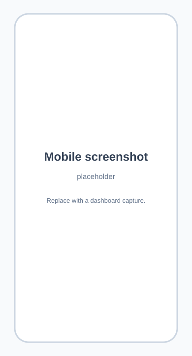

# NewsLens

NewsLens is a responsive technology-news dashboard that collects headlines from Hacker News, Dev.to, Bing News RSS, and GitHub Trending. The FastAPI backend turns each source into one consistent, HTML-free response shape; the Next.js frontend presents it as a fast, readable collection of category-based cards.

## Features

- Aggregates seven curated categories in one request: Hacker News, Dev.to, layoffs, hiring, funding, AI jobs, and GitHub Trending.
- Uses concurrent asynchronous HTTP requests so one slow source does not delay the others unnecessarily.
- Normalizes every story to separate `title`, `description`, `date`, and `link` fields.
- Removes source HTML and limits each category to three to five useful items.
- Keeps the dashboard usable when an individual external source fails; that category is returned empty and the backend writes the source error to its logs.
- Provides an accessible, mobile-first UI with a collapsed navigation menu, touch-friendly links, loading skeletons, error recovery, and responsive grids.
- Includes OpenAPI documentation automatically through FastAPI at `/docs`.

## Tech stack

| Layer | Technology | Purpose |
| --- | --- | --- |
| Backend | Python, FastAPI, Uvicorn | Async HTTP API and OpenAPI documentation |
| Data collection | HTTPX, Beautiful Soup | Concurrent requests and safe feed/HTML parsing |
| Validation/configuration | Pydantic Settings | Typed response models and environment configuration |
| Frontend | Next.js (App Router), React, TypeScript | Responsive client application |
| Styling | Tailwind CSS | Mobile-first layout, interactions, and visual design |

## Project structure

```text
NewsLens/
├── backend/
│   ├── .env.example                 # Backend configuration template
│   ├── requirements.txt             # Python dependencies
│   └── app/
│       ├── main.py                  # FastAPI app, CORS, and health endpoint
│       ├── config.py                # Environment-backed settings
│       ├── routes/news.py           # HTTP route definitions
│       ├── services/news_service.py # Async aggregation and source adapters
│       ├── models/schemas.py        # Response contract
│       └── utils/helpers.py         # Text and date normalization
├── frontend/
│   ├── app/
│   │   ├── page.tsx                 # Dashboard state and category composition
│   │   ├── layout.tsx               # App metadata and global styles
│   │   └── components/              # Navbar, Section, and NewsCard UI units
│   ├── lib/api.ts                   # Typed reusable API client
│   ├── public/screenshots/          # Screenshot placeholders
│   ├── .env.local.example           # Frontend configuration template
│   ├── package.json                 # Node scripts and dependencies
│   └── tailwind.config.ts           # Tailwind content configuration
└── README.md
```

## Prerequisites

Install the following before starting:

- Python 3.11 or later
- Node.js 20 LTS or later (includes npm)

The backend reads public sources at request time, so the machine running it needs outbound internet access.

## Setup

Clone or open the project, then configure and start the backend before the frontend.

### 1. Configure and run the backend

```powershell
cd backend
copy .env.example .env
python -m venv .venv
.\.venv\Scripts\Activate.ps1
python -m pip install --upgrade pip
pip install -r requirements.txt
uvicorn app.main:app --reload --host 127.0.0.1 --port 8000
```

On macOS/Linux, activate the virtual environment with `source .venv/bin/activate` instead. The API will be available at `http://localhost:8000`.

Verify it with:

```powershell
Invoke-RestMethod http://localhost:8000/health
```

### 2. Configure and run the frontend

Open a second terminal and run:

```powershell
cd frontend
copy .env.local.example .env.local
npm install
npm run dev
```

Open `http://localhost:3000` in a browser. For a production build, use `npm run build` followed by `npm run start`.

## Environment variables

### Backend: `backend/.env`

| Variable | Required | Default | Description |
| --- | --- | --- | --- |
| `ALLOWED_ORIGINS` | No | `http://localhost:3000` | Comma-separated frontend origins permitted by CORS. Add your deployed frontend URL here. |
| `REQUEST_TIMEOUT_SECONDS` | No | `12` | Per-request timeout for external news sources. |
| `USER_AGENT` | No | `NewsLens/1.0 (+https://github.com)` | User-Agent sent to sources that need one. |

### Frontend: `frontend/.env.local`

| Variable | Required | Default | Description |
| --- | --- | --- | --- |
| `NEXT_PUBLIC_API_URL` | Yes | `http://localhost:8000` | Public base URL of the FastAPI service. Do not include a trailing `/news/all`. |

After changing an environment file, restart the matching development server.

## API documentation

The interactive API explorer is available at [http://localhost:8000/docs](http://localhost:8000/docs) while the backend runs.

### `GET /health`

Simple deployment or uptime probe.

| Property | Value |
| --- | --- |
| URL | `http://localhost:8000/health` |
| Method | `GET` |
| Request parameters | None |

Sample response:

```json
{
  "status": "ok"
}
```

### `GET /news/all`

Returns the current dashboard feed. Each category is an array of zero to five items. An empty array indicates that the corresponding upstream source was unavailable or had no parseable stories; the endpoint still returns `200` so the working categories remain visible.

| Property | Value |
| --- | --- |
| URL | `http://localhost:8000/news/all` |
| Method | `GET` |
| Request parameters | None |
| Success response | `200 OK` |

Sample response (one item shown per category for brevity):

```json
{
  "hacker_news": [{
    "title": "Example engineering story",
    "description": "Top story from the Hacker News community.",
    "date": "2026-08-07T08:30:00+00:00",
    "link": "https://example.com/story",
    "category": "Hacker News",
    "source": "Hacker News",
    "score": 842,
    "comments": 121,
    "reactions": null,
    "tags": [],
    "stars": null,
    "stars_today": null
  }],
  "devto": [{ "title": "Example Dev.to article", "description": "A short article summary.", "date": "2026-08-07T08:00:00+00:00", "link": "https://dev.to/example", "category": "Dev.to", "source": "Dev.to", "score": null, "comments": 5, "reactions": 46, "tags": ["webdev"], "stars": null, "stars_today": null }],
  "layoffs_news": [{ "title": "Example layoffs headline", "description": "A clean feed summary.", "date": "2026-08-07T07:00:00+00:00", "link": "https://example.com/layoffs", "category": "Layoffs News", "source": "Bing News", "score": null, "comments": null, "reactions": null, "tags": [], "stars": null, "stars_today": null }],
  "hiring_news": [],
  "funding_news": [],
  "ai_jobs": [],
  "github_trending": [{ "title": "owner/project", "description": "Repository summary", "date": "Trending today", "link": "https://github.com/owner/project", "category": "GitHub Trending", "source": "GitHub", "score": null, "comments": null, "reactions": null, "tags": [], "stars": "5,789", "stars_today": "2,271 stars today" }]
}
```

## Frontend architecture

`app/page.tsx` is the dashboard container. It requests data once on mount through `getAllNews` in `lib/api.ts`, then owns loading, retry, and error states. `NEXT_PUBLIC_API_URL` is used to build the API URL, keeping localhost and deployed environments separate from application code.

- `Navbar.tsx` provides anchor navigation and changes into a compact, touch-friendly menu below the `md` breakpoint.
- `Section.tsx` renders one named category, switching from one column on mobile to two columns on tablets and three columns on desktop.
- `NewsCard.tsx` keeps the headline, summary, date, and external Read More action in separate visual elements. External links open safely in a new tab.

## Screenshots

Replace the supplied placeholders with captures from a running deployment before release documentation is published.

| Desktop dashboard | Mobile dashboard |
| --- | --- |
|  |  |

## Future improvements

- Add Redis or a database-backed cache to reduce external requests and improve response consistency.
- Add source-level observability, structured logs, and alerting for parser changes.
- Introduce automated tests with mocked HTTP responses, plus frontend component and end-to-end tests.
- Let users select topics, languages, and refresh intervals.
- Replace HTML scraping for GitHub Trending with a maintained API or a resilient provider integration if one becomes available.
- Add rate limiting and authentication if the API is exposed publicly.
